# MLOps Dev - End-to-End MLOps with Snowflake

[](LICENSE)
[](https://docs.snowflake.com/en/developer-guide/snowflake-ml)

A production-ready, modular MLOps pipeline built entirely on Snowflake, demonstrating end-to-end machine learning lifecycle management—from Feature Store setup to model serving with Snowpark Container Services (SPCS) and complete ML lineage tracking.

---

## 📋 Table of Contents

- [Overview](#overview)
- [Architecture](#architecture)
- [Project Structure](#project-structure)
- [Pipeline Components](#pipeline-components)
  - [1. Configuration & Session (`config.py`)](#1-configuration--session-configpy)
  - [2. Feature Store Pipeline (`feature_store_pipeline.py`)](#2-feature-store-pipeline-feature_store_pipelinepy)
  - [3. Model Training & Registry (`model_training_pipeline.py`)](#3-model-training--registry-model_training_pipelinepy)
  - [4. Container Deployment (`spcs_deployment.py`)](#4-container-deployment-spcs_deploymentpy)
  - [5. Batch Inference & Lineage (`inference_lineage_pipeline.py`)](#5-batch-inference--lineage-inference_lineage_pipelinepy)
  - [6. Master Orchestration (`main_pipeline.py`)](#6-master-orchestration-main_pipelinepy)
- [Getting Started](#getting-started)
- [Execution Options](#execution-options)
- [ML Lineage Graph](#ml-lineage-graph)
- [License](#license)

---

## Overview

This project implements a complete MLOps workflow using Snowflake's native ML capabilities (`snowflake-ml-python`) to predict taxi trip **duration** in minutes from NYC Green Taxi trip data.

### Key Highlights:
- **Snowflake Feature Store**: Centralized entity (`VENDOR_ID_ENTITY`), feature view (`TAXI_TRIP_FEATURES`), and training dataset creation (`TAXI_TRIP_TRAINING_DATASET`) with point-in-time correctness.
- **Model Training & Packaging**: Scikit-Learn pipeline (`DataFrameDictVectorizer` + `RandomForestRegressor`) enabling direct DataFrame inputs without external pre-transforms.
- **Model Registry & Experiments**: Experiment tracking via `snowflake.ml.experiment` and versioned model logging via `snowflake.ml.registry.Registry`.
- **Snowpark Container Services (SPCS)**: Model deployment to dedicated CPU/GPU compute pools for containerized REST API serving.
- **Batch Inference & ML Lineage**: Saving model predictions to `ML_DB.OUTPUTS.MODEL_PREDICTIONS` alongside model name, version, feature view, and training dataset metadata.

---

## Architecture

```mermaid
flowchart LR
    subgraph RawData["📊 Raw Data"]
        A[ML_DB.FEATURES.RAW_DATA]
    end

    subgraph FeatureStore["🏪 Feature Store"]
        B[ENGINEERED_FEATURES]
        C["Entity<br/>VENDOR_ID_ENTITY"]
        D["Feature View<br/>TAXI_TRIP_FEATURES:V1"]
    end

    subgraph Training["🎯 Training & Experiments"]
        E["Training Dataset<br/>TAXI_TRIP_TRAINING_DATASET:V1"]
        F["ML Experiment Tracking<br/>snowflake.ml.experiment"]
        G["Model Pipeline<br/>RandomForestRegressor"]
    end

    subgraph Registry["📦 Model Registry"]
        H["Registered Model<br/>TAXI_DURATION_PREDICTOR:V1"]
    end

    subgraph Serving["🚀 Model Serving"]
        I["SPCS Compute Pool<br/>ML_COMPUTE_POOL"]
        J["Snowpark UDF / REST Endpoint"]
    end

    subgraph Lineage["🔗 Output & Lineage"]
        K["Output Table<br/>ML_DB.OUTPUTS.MODEL_PREDICTIONS"]
    end

    A --> B
    B --> C
    B --> D
    D --> E
    E --> F
    F --> G
    G --> H
    H --> I
    I --> J
    J --> K
    H --> K
    E --> K

    style RawData fill:#e1f5ff
    style FeatureStore fill:#fff4e1
    style Training fill:#f0f9ff
    style Registry fill:#f5f0ff
    style Serving fill:#e8f5e9
    style Lineage fill:#fff8e1
```



---

## Project Structure

```text
snowflake/
├── config.py                     # Connection parameters, database & model constants
├── setup.sql                     # Snowflake SQL setup script for schemas, stages & SPCS pool
├── feature_store_pipeline.py     # Feature Store setup (Entity, FeatureView & Training Dataset)
├── model_training_pipeline.py    # Sklearn pipeline training, experiment tracking & registry
├── spcs_deployment.py            # Deployment to Snowpark Container Services (SPCS)
├── inference_lineage_pipeline.py # Batch inference, output table & lineage logging
├── main_pipeline.py              # Master orchestrator running the end-to-end pipeline
├── development_mlops.ipynb       # Interactive notebook walking through each stage
├── requirements.txt              # Required Python packages
└── README.md                     # Documentation
```

---

## Pipeline Components

### 1. Configuration & Session (`config.py`)
Centralized environment configuration managing database credentials and object names (`ML_DB`, `FEATURES`, `MODELS`, `OUTPUTS`).

```python
from config import get_snowflake_session
session = get_snowflake_session()
```

### 2. Feature Store Pipeline (`feature_store_pipeline.py`)
Computes trip `DURATION` in minutes, registers `VENDOR_ID_ENTITY`, creates `TAXI_TRIP_FEATURES` feature view, and generates `TAXI_TRIP_TRAINING_DATASET`.

```python
from feature_store_pipeline import setup_feature_store
fs, training_dataset = setup_feature_store(session)
```

### 3. Model Training & Registry (`model_training_pipeline.py`)
Wraps categorical vectorization (`DictVectorizer`) and `RandomForestRegressor` into a single pipeline, logs experiment runs, and registers the versioned model in `ML_DB.MODELS`.

```python
from model_training_pipeline import train_and_register_model
registry, registered_model = train_and_register_model(session, training_dataset)
```

### 4. Container Deployment (`spcs_deployment.py`)
Deploys the registered model version directly to Snowpark Container Services (`ML_COMPUTE_POOL`).

```python
from spcs_deployment import deploy_to_spcs
deploy_to_spcs(session)
```

### 5. Batch Inference & Lineage (`inference_lineage_pipeline.py`)
Runs predictions on new trip data and saves the output to `ML_DB.OUTPUTS.MODEL_PREDICTIONS` with complete lineage tracking metadata.

```python
from inference_lineage_pipeline import run_batch_inference_and_lineage
results_df = run_batch_inference_and_lineage(session, limit=100)
```

### 6. Master Orchestration (`main_pipeline.py`)
Executes all stages sequentially:

```bash
python main_pipeline.py
```

---

## Getting Started

### Prerequisites

- Python 3.9+
- Active Snowflake account with Snowpark and Snowflake ML enabled
- Installed Python packages (`pip install -r requirements.txt`)

### 1. SQL Environment Setup
Run `setup.sql` in Snowsight or via SnowSQL with `ACCOUNTADMIN` privileges to create schemas, stages, compute pools, and roles:

```sql
-- Run setup.sql in Snowflake
```

### 2. Install Dependencies
```bash
pip install -r requirements.txt
```

---

## Execution Options

### Option A: Modular Python Pipeline
Run individual pipeline components or the full orchestrator:

```bash
# Run full pipeline end-to-end
python main_pipeline.py

# Or run individual stages
python feature_store_pipeline.py
python model_training_pipeline.py
python spcs_deployment.py
python inference_lineage_pipeline.py
```

### Option B: Interactive Jupyter Notebook
Open and run `development_mlops.ipynb` for step-by-step interactive execution.

---

## ML Lineage Graph

All generated predictions track end-to-end lineage back to the training dataset and raw source table:

| Column Name | Description | Example Value |
|---|---|---|
| `PULOCATIONID` | Pickup location ID | `70` |
| `DOLOCATIONID` | Dropoff location ID | `82` |
| `TRIP_DISTANCE` | Trip distance in miles | `2.44` |
| `ACTUAL_DURATION_MINUTES` | Ground truth trip duration | `12.5` |
| `PREDICTED_DURATION_MINUTES` | Model prediction | `13.1` |
| `MODEL_NAME` | Registered model name | `TAXI_DURATION_PREDICTOR` |
| `MODEL_VERSION` | Model version | `V1` |
| `FEATURE_VIEW` | Snowflake Feature View | `TAXI_TRIP_FEATURES:V1` |
| `TRAINING_DATASET` | Snowflake Training Dataset | `TAXI_TRIP_TRAINING_DATASET:V1` |
| `INFERENCE_TIMESTAMP` | Time of prediction execution | `2026-09-06T00:25:00` |

---

## License

This project is licensed under the MIT License - see the LICENSE file for details.