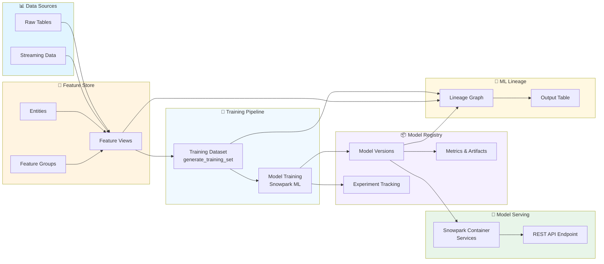
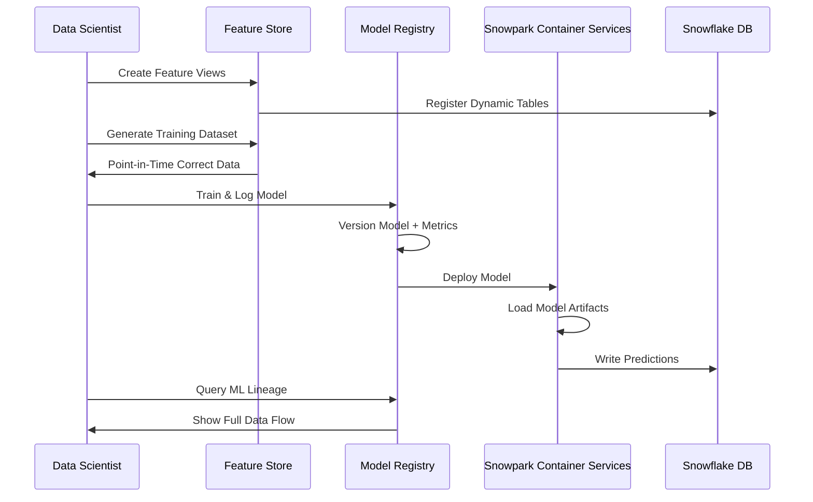
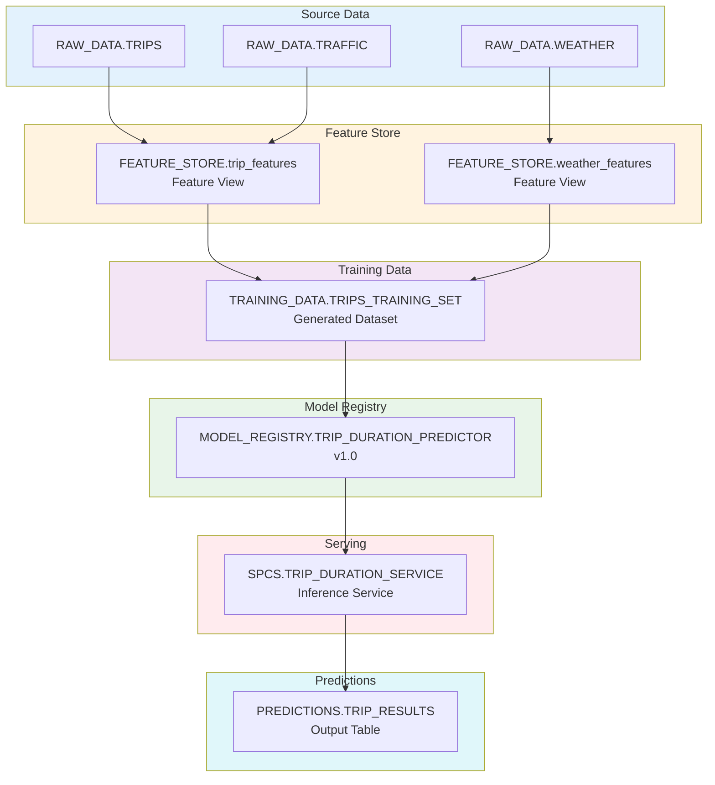

# MLOps Dev - End-to-End MLOps with Snowflake

[](LICENSE)
[](https://docs.snowflake.com/en/developer-guide/snowflake-ml)

A production-ready MLOps pipeline built entirely on Snowflake, demonstrating end-to-end machine learning lifecycle management—from feature engineering to model serving with complete ML lineage tracking.

## 📋 Table of Contents

- [Overview](#overview)
- [Architecture](#architecture)
- [Project Structure](#project-structure)
- [Key Components](#key-components)
  - [Feature Store](#feature-store)
  - [Dataset Creation](#dataset-creation)
  - [Model Training](#model-training)
  - [Model Registry](#model-registry)
  - [Model Serving with Snowpark Container Services](#model-serving-with-snowpark-container-services)
  - [ML Lineage Tracking](#ml-lineage-tracking)
- [Getting Started](#getting-started)
- [Usage](#usage)
- [Monitoring & Observability](#monitoring--observability)
- [Contributing](#contributing)
- [License](#license)

## Overview

This project implements a complete MLOps workflow using Snowflake's native ML capabilities to predict **duration** and **speed** from a sample dataset. The pipeline leverages:

- **Snowflake Feature Store** for centralized feature management and point-in-time correct training datasets
- **Snowflake Model Registry** for experiment tracking and model versioning
- **Snowpark Container Services (SPCS)** for scalable model serving
- **ML Lineage** for end-to-end data flow tracking from source tables to deployed models

The entire workflow runs within Snowflake, ensuring data governance, security, and compliance while eliminating data movement.

## Architecture

### High-Level MLOps Pipeline



### Complete MLOps Workflow



## Project Structure
mlops-dev/
├── notebooks/
│ ├── 01_feature_engineering.ipynb # Feature Store setup
│ ├── 02_dataset_creation.ipynb # Training dataset generation
│ ├── 03_model_training.ipynb # Model training & registry
│ └── 04_model_deployment.ipynb # SPCS deployment
├── src/
│ ├── features.py # Feature transformation logic
│ ├── training.py # Training pipeline
│ ├── inference.py # Inference script for SPCS
│ └── config.py # Configuration management
├── sql/
│ ├── setup.sql # Database & schema creation
│ ├── compute_pool.sql # SPCS compute pool setup
│ └── lineage_query.sql # ML lineage tracking queries
├── docker/
│ └── Dockerfile # Container image for SPCS
├── tests/
│ └── test_pipeline.py # Pipeline tests
├── requirements.txt # Python dependencies
├── README.md # This file
└── LICENSE

text

## Key Components

### Feature Store

The Snowflake Feature Store provides centralized feature management with point-in-time correctness.

```python
from snowflake.ml.feature_store import (
    FeatureStore,
    FeatureView,
    Entity,
)
from snowflake.snowpark import Session

# Initialize session and feature store
session = Session.builder.getOrCreate()
fs = FeatureStore(session=session, database_name="MLOPS_DEV", schema_name="FEATURE_STORE")

# Register entity
fs.create_entity(
    name="trip_entity",
    join_keys=["trip_id"],
    description="Trip-level entity for duration and speed prediction"
)

# Create feature view
@fs.create_feature_view(
    name="trip_features",
    version="1.0",
    entities=["trip_entity"],
    refresh_mode="INCREMENTAL",
    schedule="0 0 * * *"  # Daily refresh
)
def create_trip_features(session):
    df = session.table("MLOPS_DEV.RAW_DATA.TRIPS")
    return df.select(
        "trip_id",
        "distance",
        "traffic_level",
        "weather_condition",
        "hour_of_day",
        "day_of_week"
    )
```

**Key Benefits:**
- ✅ Point-in-time correct feature computation using ASOF JOIN
- ✅ Automatic incremental refresh from source tables
- ✅ Feature reuse across multiple models
- ✅ Integration with Snowflake's data governance

### Dataset Creation

Generate training datasets directly from feature views:

```python
# Create spine DataFrame (rows to train on)
spine_df = session.table("MLOPS_DEV.RAW_DATA.TRIPS").select(
    "trip_id",
    "start_time",
    "duration",  # Target
    "speed"      # Target
)

# Generate point-in-time correct training dataset
training_df = fs.generate_training_set(
    spine_df=spine_df,
    feature_group="trip_features",
    spine_timestamp_col="start_time",
    spine_label_cols=["duration", "speed"],
    include_feature_view_timestamp_col=False
)

training_df.write.mode("overwrite").save_as_table(
    "MLOPS_DEV.TRAINING_DATA.TRIPS_TRAINING_SET"
)
```

### Model Training

Train and register models using Snowpark ML:

```python
from snowflake.ml.registry import Registry
from snowflake.ml.models import XGBRegressor
from sklearn.model_selection import train_test_split
from sklearn.metrics import mean_absolute_error, r2_score

# Load training data
train_df = session.table("MLOPS_DEV.TRAINING_DATA.TRIPS_TRAINING_SET")
pdf = train_df.to_pandas()

# Prepare features and targets
feature_cols = ["distance", "traffic_level", "weather_condition", 
                "hour_of_day", "day_of_week"]
X = pdf[feature_cols]
y_duration = pdf["duration"]
y_speed = pdf["speed"]

# Train duration model
X_train, X_test, y_train, y_test = train_test_split(X, y_duration, test_size=0.2)
duration_model = XGBRegressor(n_estimators=100, max_depth=6)
duration_model.fit(X_train, y_train)

# Evaluate
y_pred = duration_model.predict(X_test)
mae = mean_absolute_error(y_test, y_pred)
r2 = r2_score(y_test, y_pred)

# Register model
registry = Registry(
    session=session,
    database_name="MLOPS_DEV",
    schema_name="MODEL_REGISTRY"
)

model_ref = registry.log_model(
    model_name="TRIP_DURATION_PREDICTOR",
    version_name="v1.0",
    model=duration_model,
    target_platforms=["WAREHOUSE", "SNOWPARK_CONTAINER_SERVICES"],
    conda_dependencies=["scikit-learn", "xgboost"],
    sample_input_data=X_train.head(1),
    metrics={
        "mae": mae,
        "r2": r2,
        "training_samples": len(X_train),
        "test_samples": len(X_test)
    },
    description="Predicts trip duration based on distance, traffic, and weather"
)
```

### Model Registry

The Model Registry provides:
- **Version Control**: Track multiple model versions with metadata
- **Experiment Tracking**: Compare metrics across training runs
- **ML Lineage**: Automatic tracking of datasets, features, and source tables
- **Deployment**: Direct deployment to Snowpark Container Services

```python
# Query model versions
models = registry.get_models()
for model in models:
    print(f"Model: {model.name}, Versions: {model.versions}")

# Set default version for inference
model_ref.set_default()

# View lineage in Snowsight UI
# Navigate to: AI & ML → Models → [Your Model] → Lineage Tab
```

### Model Serving with Snowpark Container Services

Deploy models as scalable REST API endpoints:

**Step 1: Create Compute Pool**

```sql
-- Create compute pool for model serving
CREATE COMPUTE POOL MLOPS_DEV_POOL
  MIN_NODES = 1
  MAX_NODES = 5
  INSTANCE_FAMILY = CPU_X64_XS;
```

**Step 2: Create Image Repository**

```sql
-- Create image repository for container images
CREATE IMAGE REPOSITORY MLOPS_DEV_IMAGES;
```

**Step 3: Build and Push Container Image**

```bash
# Build Docker image locally
docker build -t trip-duration-model:v1 -f docker/Dockerfile .

# Tag for Snowflake registry
docker tag trip-duration-model:v1 \
  <org>-<account>.registry.snowflakecomputing.com/mlops_dev/model_registry/ml_images/trip-duration-model:v1

# Push to Snowflake
docker push <org>-<account>.registry.snowflakecomputing.com/mlops_dev/model_registry/ml_images/trip-duration-model:v1
```

**Step 4: Deploy Model**

```python
from snowflake.ml.model import Model

# Load registered model
model = Model.from_name(
    session=session,
    model_name="TRIP_DURATION_PREDICTOR",
    version_name="v1.0"
)

# Deploy to SPCS
service = model.deploy(
    service_name="TRIP_DURATION_SERVICE",
    compute_pool="MLOPS_DEV_POOL",
    create_api_endpoint=True,
    num_workers=2,
    cpu=1000,  # milli-cores
    memory=2048  # MB
)

print(f"Service deployed: {service.service_name}")
print(f"API Endpoint: {service.api_endpoint}")
```

**Step 5: Invoke Model**

```python
# SQL invocation
SELECT MLOPS_DEV.MODEL_REGISTRY.TRIP_DURATION_PREDICTOR!predict(
    OBJECT_CONSTRUCT(
        'distance', 15.5,
        'traffic_level', 3,
        'weather_condition', 1,
        'hour_of_day', 14,
        'day_of_week', 2
    )
) AS predicted_duration;

# Python invocation
import requests

api_endpoint = service.api_endpoint
headers = {"Authorization": f"Bearer {service.api_token}"}

payload = {
    "distance": 15.5,
    "traffic_level": 3,
    "weather_condition": 1,
    "hour_of_day": 14,
    "day_of_week": 2
}

response = requests.post(api_endpoint, json=payload, headers=headers)
prediction = response.json()
```

### ML Lineage Tracking

Snowflake automatically tracks ML lineage from source tables through features to deployed models:

```sql
-- Query ML lineage for a model
SELECT 
    m.name AS model_name,
    mv.version_name,
    mv.lineage_graph
FROM MLOPS_DEV.MODEL_REGISTRY.MODELS m
JOIN MLOPS_DEV.MODEL_REGISTRY.MODEL_VERSIONS mv 
    ON m.id = mv.model_id
WHERE m.name = 'TRIP_DURATION_PREDICTOR';

-- View lineage in Snowsight
-- AI & ML → Models → TRIP_DURATION_PREDICTOR → Lineage Tab
```

**Lineage Graph Visualization:**



**Complete ML Lineage Query:**

```sql
-- Full lineage tracking query
WITH model_lineage AS (
    SELECT 
        m.name AS model_name,
        mv.version_name,
        mv.lineage_graph,
        mv.created_at
    FROM MLOPS_DEV.MODEL_REGISTRY.MODELS m
    JOIN MLOPS_DEV.MODEL_REGISTRY.MODEL_VERSIONS mv 
        ON m.id = mv.model_id
    WHERE m.name = 'TRIP_DURATION_PREDICTOR'
)
SELECT 
    model_name,
    version_name,
    created_at,
    GET_PATH(lineage_graph, '$.nodes[*].name') AS source_tables,
    GET_PATH(lineage_graph, '$.edges[*].source') AS feature_views,
    GET_PATH(lineage_graph, '$.edges[*].target') AS datasets
FROM model_lineage;
```

**Output Table for Lineage Demonstration:**

```sql
-- Create lineage output table
CREATE OR REPLACE TABLE MLOPS_DEV.LINEAGE_TRACKING.ML_LINEAGE_OUTPUT (
    model_name STRING,
    version_name STRING,
    source_tables ARRAY,
    feature_views ARRAY,
    training_dataset STRING,
    deployed_service STRING,
    created_at TIMESTAMP,
    metrics OBJECT
);

-- Insert lineage record
INSERT INTO MLOPS_DEV.LINEAGE_TRACKING.ML_LINEAGE_OUTPUT
SELECT 
    'TRIP_DURATION_PREDICTOR',
    'v1.0',
    ['RAW_DATA.TRIPS', 'RAW_DATA.WEATHER', 'RAW_DATA.TRAFFIC'],
    ['FEATURE_STORE.trip_features', 'FEATURE_STORE.weather_features'],
    'TRAINING_DATA.TRIPS_TRAINING_SET',
    'SPCS.TRIP_DURATION_SERVICE',
    CURRENT_TIMESTAMP(),
    OBJECT_CONSTRUCT('mae', 2.34, 'r2', 0.89)
;
```

## Getting Started

### Prerequisites

- Snowflake account with ML features enabled
- Python 3.9+
- Snowpark ML: `pip install snowflake-ml-python`
- Docker (for SPCS deployment)

### Setup

1. **Clone the repository**

```bash
git clone https://github.com/yourusername/mlops-dev.git
cd mlops-dev
```

2. **Install dependencies**

```bash
pip install -r requirements.txt
```

3. **Configure Snowflake connection**

```bash
export SNOWFLAKE_ACCOUNT="<your-account>"
export SNOWFLAKE_USER="<your-user>"
export SNOWFLAKE_PASSWORD="<your-password>"
export SNOWFLAKE_ROLE="MLOPS_DEV_ROLE"
export SNOWFLAKE_WAREHOUSE="MLOPS_DEV_WH"
```

4. **Run setup SQL**

```bash
snowsql -f sql/setup.sql
```

5. **Execute notebooks in order**
notebooks/01_feature_engineering.ipynb
notebooks/02_dataset_creation.ipynb
notebooks/03_model_training.ipynb
notebooks/04_model_deployment.ipynb

text

## Usage

### Training a New Model Version

```python
# Run training pipeline
python src/training.py --model-name TRIP_DURATION_PREDICTOR --version v2.0

# This will:
# 1. Generate fresh training dataset from Feature Store
# 2. Train model with hyperparameter tuning
# 3. Log to Model Registry with metrics
# 4. Update ML lineage automatically
```

### Deploying to Production

```python
# Deploy latest model version
python src/deployment.py --model-name TRIP_DURATION_PREDICTOR --service-name PROD_DURATION_SERVICE

# This will:
# 1. Fetch latest model from Registry
# 2. Build container image
# 3. Deploy to SPCS compute pool
# 4. Create REST API endpoint
```

### Monitoring Predictions

```sql
-- Query prediction output table
SELECT * 
FROM MLOPS_DEV.PREDICTIONS.TRIP_RESULTS
ORDER BY prediction_timestamp DESC
LIMIT 100;

-- Monitor prediction distribution
SELECT 
    DATE(prediction_timestamp) AS prediction_date,
    AVG(predicted_duration) AS avg_duration,
    AVG(predicted_speed) AS avg_speed,
    COUNT(*) AS prediction_count
FROM MLOPS_DEV.PREDICTIONS.TRIP_RESULTS
GROUP BY DATE(prediction_timestamp)
ORDER BY prediction_date DESC;
```

## Monitoring & Observability

### Model Performance Monitoring

```python
from snowflake.ml.monitoring import ModelMonitor

# Create monitor for deployed model
monitor = ModelMonitor(
    session=session,
    model_name="TRIP_DURATION_PREDICTOR",
    service_name="TRIP_DURATION_SERVICE"
)

# Track drift and performance
monitor.enable(
    metrics=["prediction_drift", "feature_drift", "latency"],
    schedule="0 */6 * * *"  # Every 6 hours
)
```

### Query History for Lineage

```sql
-- Track all queries that contributed to model training
SELECT 
    query_text,
    start_time,
    end_time,
    total_elapsed_time
FROM SNOWFLAKE.ACCOUNT_USAGE.QUERY_HISTORY
WHERE database_name = 'MLOPS_DEV'
    AND query_text LIKE '%TRIP_DURATION_PREDICTOR%'
ORDER BY start_time DESC
LIMIT 50;
```

## Contributing

1. Fork the repository
2. Create a feature branch (`git checkout -b feature/amazing-feature`)
3. Commit your changes (`git commit -m 'Add amazing feature'`)
4. Push to the branch (`git push origin feature/amazing-feature`)
5. Open a Pull Request

## License

This project is licensed under the MIT License - see the [LICENSE](LICENSE) file for details.

## Resources

- [Snowflake ML Documentation](https://docs.snowflake.com/en/developer-guide/snowflake-ml)
- [Feature Store Guide](https://docs.snowflake.com/en/developer-guide/snowflake-ml/feature-store/overview)
- [Model Registry Documentation](https://docs.snowflake.com/en/developer-guide/snowflake-ml/model-registry)
- [Snowpark Container Services](https://docs.snowflake.com/en/developer-guide/snowpark-container-services)
- [ML Lineage Tracking](https://docs.snowflake.com/en/developer-guide/snowflake-ml/model-registry/snowsight-ui#model-details)

---

**Built with ❤️ using Snowflake ML**